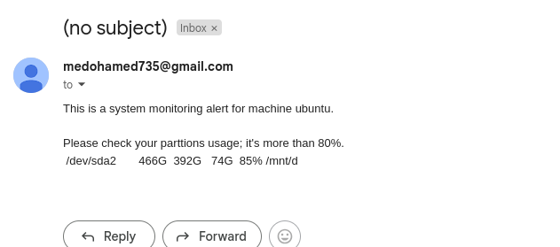

# System Monitoring Script

This script monitors the system's disk usage, memory usage, CPU usage, and top 5 running processes. It sends email alerts when specific thresholds are exceeded, and logs the system's status in a log file.

## Features

- Monitor disk usage and send email alerts if usage exceeds a specified threshold.
- Check memory usage and alert if memory is below a defined threshold.
- Monitor CPU usage and alert if CPU usage exceeds a given threshold.
- Log system statistics including disk usage, memory usage, CPU usage, and running processes.
- Supports customization of file name, disk threshold, and email account via command-line options.

## Requirements

- Linux-based system with `df`, `free`, `top`, and `msmtp` commands available.
- `msmtp` configured for sending email notifications.

## Installation

1. Save the script to a file (e.g., `system_monitoring.sh`).
2. Make the script executable:

    ```bash
    chmod +x system_monitoring.sh
    ```

3. Install `msmtp` (if not installed) to send email notifications:

    ```bash
    sudo apt-get install msmtp
    ```

4. Configure `msmtp` with your email provider's SMTP settings

    ```bash
    sudo cat ~/.msmtprc 
    ```
```    
account default
host smtp.gmail.com
port 587
from <sender>@gmail.com
user <sender>@gmail.com
password <TOKEN>  // create password at google don't put your email password 
auth plain
tls on
tls_trust_file /etc/ssl/certs/ca-certificates.crt
```

## screenshots





## Usage

Run the script with optional flags for customization:

```bash
./system_monitoring.sh [-f file_name] [-t disk_threshold] [-e email_account]

